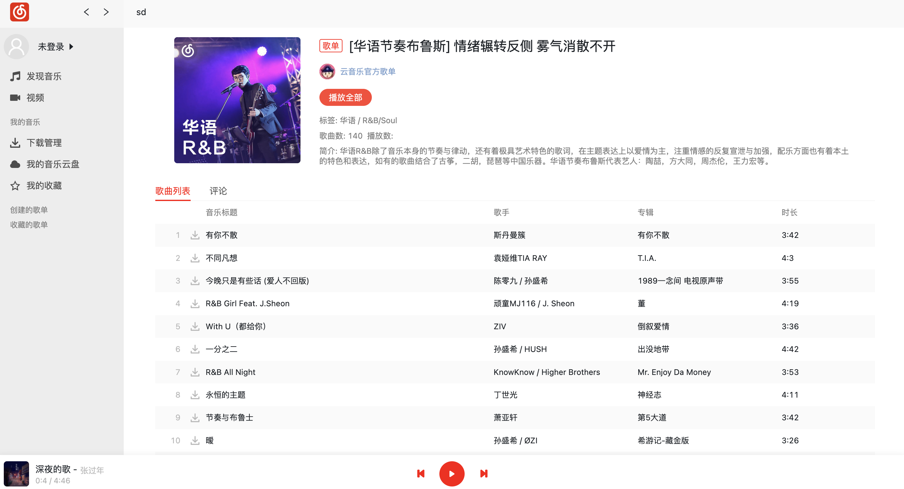

# React Netease Music

React Netease Music——一个基于 React17、Webpack5、TypeScript 的高仿网易云 mac 客户端播放器。

## 功能列表

-   [x] 登录/登出
-   [x] 发现页
    -   [x] banner
    -   [x] 推荐歌单
    -   [x] 推荐最新音乐
    -   [x] 推荐 MV（仅是入口，详情待实现）
-   [x] 每日歌曲推荐页
-   [x] 全部歌单页
    -   [x] 歌单分类查询
-   [x] 最新音乐页
-   [ ] 歌单详情页
-   [ ] 音乐播放详情页
    -   [ ] 歌曲评论
    -   [ ] 点赞/取消点赞歌曲评论
    -   [ ] 歌词滚动
    -   [ ] 歌曲所在歌单
    -   [ ] 相似歌曲推荐
-   [ ] 播放记录功能
    -   [ ] 播放列表
    -   [ ] 历史记录
-   [ ] 搜索功能
    -   [ ] 热门搜索关键字
    -   [ ] 搜索建议
    -   [ ] 搜索结果页
-   [ ] 创建的歌单列表
-   [ ] 收藏的歌单列表
-   [ ] 排行榜
-   [ ] 所有歌手页
-   [ ] 歌手详情页
-   [ ] MV 相关的页面与功能
-   [ ] 创建/编辑/删除歌单
-   [ ] 私信/@我/评论等通知功能
-   [ ] 主题换肤

## 技术栈

-   React，使用 react-redux 做状态管理。
-   TypeScript，用 TypeScript 确实可以提高效率。
-   CSS Modules。
-   Webpack。
-   Eslint 做代码检查。

## API 接口

-   [NeteaseCloudMusicApi](https://binaryify.github.io/NeteaseCloudMusicApi)

## 播放器的相关截图




## 项目启动

-   首先将上面提到的 API 接口部分，代码拉到本地，并启动对应的服务；
-   然后拉取本仓库代码，并执行以下命令：(node 版本 v14.15)

```
npm install
npm start
```

-   最后在浏览器中访问：`http://localhost:8080`
